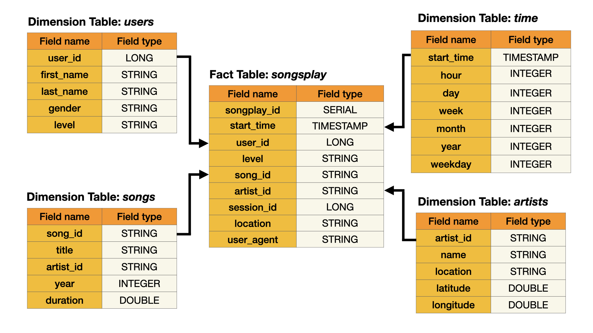
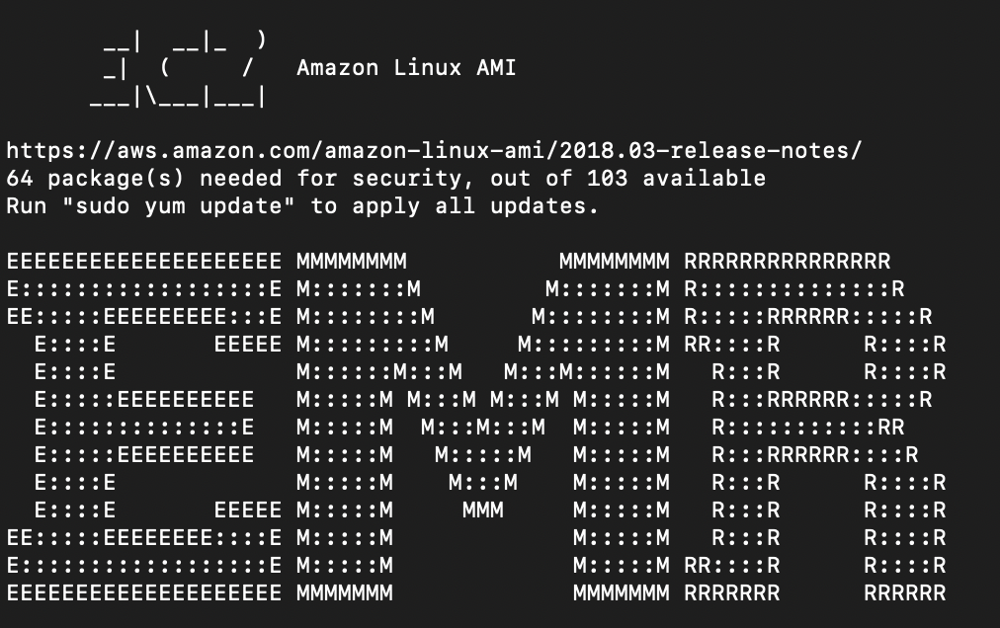

# Building a Data Lake

The music streaming startup, Sparkify, has grown their user base and song database even more and want to move their data warehouse to a data lake. Their data resides in S3, in a directory of JSON logs on user activity on the app, as well as a directory with JSON metadata on the songs in their app.

In this project, we will build a data lake and an ETL pipeline in Spark that loads data from S3, processes the data into analytics tables, and loads them back into S3.

## Data Overview

We will work with two datasets which reside in S3 with the following S3 links:
- Song data: `s3://udacity-dend/song_data`
- Log data: `s3://udacity-dend/log_data`

The song dataset is a subset of real data from the Million Song Dataset. Each file is in JSON format and contains metadata about a song and the artist of that song. The files are partitioned by the first three letters of each song's track ID. For example, here re filepaths to two files in this dataset.

```
song_data/A/B/C/TRABCEI128F424C983.json
song_data/A/A/B/TRAABJL12903CDCF1A.json
```

Here is an example of what a single song file looks like.

```json
{"num_songs": 1, "artist_id": "ARJIE2Y1187B994AB7", "artist_latitude": null, "artist_longitude": null, "artist_location": "", "artist_name": "Line Renaud", "song_id": "SOUPIRU12A6D4FA1E1", "title": "Der Kleine Dompfaff", "duration": 152.92036, "year": 0}
```

The log dataset consists of log files in JSON format generated by this event simulator based on the songs in the dataset above. These simulate app activity logs from an imaginary music streaming app based on configuration settings.

The log files are partitioned by year and month. For example, here are filepaths to two files in this dataset.

```
log_data/2018/11/2018-11-12-events.json
log_data/2018/11/2018-11-13-events.json
```

And below is an example of what the data in a log file looks like.


## Data Modeling

We'll use a _star database schema_ as a data model for this ETL pipeline. This model includes one fact table and four dimensions tables which will enable fast read queries.

Both, song and log data will be queried through Spark from their respective S3 buckets. After processing the data, we'll store the processed tables in parquet files in our own S3 bucket.

The ERD of the data model is given below.



## Getting Started

We'll start by running `create_cluster.sh` which goes through the following steps:
1. Create a new S3 bucket named `project3-data-lake-bucket` where we will store the parquet files.
2. Copy `bootstrap.sh` from local to the S3 bucket. The _bootstrap action_ is used to install additional software or customize the configuration of the cluster instance. We'll use it to upgrade `pip` and install the `configparser` library.
3. Copy `configurations.json` from local to the S3 bucket to override the default configurations for Spark.
3. Get a subnet ID: `aws ec2 describe-subnets --query "Subnets[0].SubnetId"`.
4. Create the EMR cluster using the subnet ID and other parameters set by us: `aws emr create-cluster --name data-lake-project --use-default-roles --release-label 5.28.0 --instance-count 3 --applications Name=Spark --bootstrap-actions Path=s3://project3-data-lake-bucket/resources/bootstrap.sh --configurations configurations.json --ec2-attributes "KeyName=spark-cluster,SubnetId=<subnet-id>" --instance-type m5.xlarge --profile default`.
5. Get the EMR cluster ID: `aws emr list-clusters --active --query "Clusters[0].Id"`.
6. Once the cluster is running, get the instance IDs for the running cluster: `aws emr list-instances --cluster-id <cluster-id> --instance-group-types MASTER --query "Instances[0].Ec2InstanceId"`.
7. Get the security group for one of the EC2 instances: `aws ec2 describe-instance-attribute --instance-id <instance-id> --attribute groupSet --query 'Groups[*].GroupId | [0]'`. Then, for the specific security group, get the any existing CIDR blocks used to/from port 22 and revoke the inbound rule.
    1. Retrieve old CIDR block: `aws ec2 describe-security-groups --filters Name=ip-permission.from-port,Values=22 Name=ip-permission.to-port,Values=22 Name=ip-permission.protocol,Values=tcp --group-ids <security-group> --query 'SecurityGroups[*].IpPermissions[?FromPort==`22`] | [0][0].IpRanges[*].CidrIp | [0]'`.
    2. Revoke inbound rule with previous CIDR block: `aws ec2 revoke-security-group-ingress --group-id <security-group> --protocol tcp --port 22 --cidr <old-cidr-block>`.
8. Next, we'll create a new inbound security rule using our current IP address:
    1. Retrieve our IP address: `curl -s http://whatismyip.akamai.com/`.
    2. Authorize inbound rule: `aws ec2 authorize-security-group-ingress --group-id <security-group> --protocol tcp --port 22 --cidr <my-ip>/32`.
9. Retrieve the cluster's master public DNS name which we'll use to copy files into the cluster's master node: `aws emr describe-cluster --cluster-id <cluster-id> --query 'Cluster.MasterPublicDnsName'`.
10. Copy both `dl.cfg` and `etl.py` files to the cluster's master node. This is the general syntax for copying files: `scp -i ~/<aws-pem-key-file>.pem <local-path-of-file> hadoop@<master-dns>:/home/hadoop/`. See `dl_example.cfg` to understand how the content of this file is organized. 
    * **_Hint:_** If asked `Are you sure you want to continue connecting (yes/no/[fingerprint])?`, enter `yes`.

Once the `setup_cluster.sh` file has run successfully, we'll copy the last line printed on the terminal by the execution of the file which will look something like `aws emr ssh --cluster-id <cluster-id> --key-pair-file ~/<aws-pem-key-file>.pem`.

Next, we'll just run it on the terminal. This will give us access to the EMR cluster master node through our terminal.



## Running the ETL Pipeline

The ETL Pipeline will extract data from S3, process the data using Spark, and finally load the data back into S3 as a set of dimensional tables. To execute `etl.py` on EMR, use

```bash
spark-submit --master yarn ./etl.py
```


### Processing Song Data

Let's start by understanding how song data is processed in the ETL pipeline.

```python
# get filepath to song data files
song_data = f"{SONG_DATA}/*/*/*/*.json"

# song schema
songSchema = StructType([
    StructField("num_songs", IntegerType()),
    StructField("artist_id", StringType()),
    StructField("artist_latitude", DoubleType()),
    StructField("artist_longitude", DoubleType()),
    StructField("artist_location", StringType()),
    StructField("artist_name", StringType()),
    StructField("song_id", StringType()),
    StructField("title", StringType()),
    StructField("duration", DoubleType()),
    StructField("year", IntegerType())
])

# read song data file
song_df = spark.read.json(song_data, schema=songSchema)

# extract columns to create songs table
songs_header = ["title", "artist_id", "year", "duration"]
songs_table = song_df.select(songs_header).where(song_df.song_id.isNotNull()).dropDuplicates()

# generate song_id
songs_table = songs_table.withColumn("song_id", monotonically_increasing_id())

# write songs table to parquet files partitioned by year and artist
songs_partitionBy = ["year", "artist_id"]
songs_table.write.mode("overwrite").partitionBy(songs_partitionBy).parquet(f"{output_data}/songs")

# extract columns to create artists table
artists_header = ["artist_id", "artist_name as name", "artist_location as location", "artist_latitude as latitude", "artist_longitude as longitude"]
artists_table = song_df.selectExpr(artists_header).where(song_df.artist_id.isNotNull() & song_df.artist_name.isNotNull()).dropDuplicates()

# write artists table to parquet files
artists_table.write.mode("overwrite").parquet(f"{output_data}/artists")
```

### Processing Log Data

```python
# get filepath to log data file
log_data = f"{LOG_DATA}/*/*/*.json"

logSchema = {
    "artist": StringType(),
    "auth": StringType(),
    "firstName": StringType(),
    "gender": StringType(),
    "itemInSession": LongType(),
    "lastName": StringType(),
    "length": DoubleType(),
    "level": StringType(),
    "location": StringType(),
    "method": StringType(),
    "page": StringType(),
    "registration": TimestampType(),
    "sessionId": LongType(),
    "song": StringType(),
    "status": IntegerType(),
    "ts": TimestampType(),
    "userAgent": StringType(),
    "userId": LongType()
}

# read log data file
log_df = spark.read.json(log_data)

# remove entries where userId is empty string
log_df = log_df.where(log_df.userId != "")

# convert columns to timestamp
to_timestamp = ["registration", "ts"]
timestamp_udf = udf(lambda x: datetime.utcfromtimestamp(int(x) / 1000.0), TimestampType())
for column in to_timestamp:
    log_df = log_df.withColumn(column, timestamp_udf(column))

# cast log schema to the log dataframe
log_df = log_df.select([col(column).cast(logSchema[column]) for column in log_df.columns])

# filter by actions for song plays
log_df = log_df.where(log_df.page == "NextSong")

# extract columns for users table
users_header = ["userId as user_id", "firstName as first_name", "lastName as last_name", "gender", "level"]
users_table = log_df.selectExpr(users_header).where(log_df.userId.isNotNull()).dropDuplicates()

# write users table to parquet files
users_table.write.mode("overwrite").parquet(f"{output_data}/users")

# extract columns to create time table
time_table = log_df.selectExpr("ts as start_time").where(log_df.ts.isNotNull()).dropDuplicates()

# create new columns for time table
time_header = ["hour", "day", "week", "month", "year", "weekday"]
time_func = [hour, dayofmonth, weekofyear, month, year, dayofweek]
for column, column_func in zip(time_header, time_func):
    time_table = time_table.withColumn(column, column_func("start_time"))

# write time table to parquet files partitioned by year and month
time_partitionBy = ["year", "month"]
time_table.write.mode("overwrite").partitionBy(time_partitionBy).parquet(f"{output_data}/time")

# extract columns from joined song and log datasets to create songplays table
logDf_songDf_header = [monotonically_increasing_id().alias("songplay_id"), col("ts").alias("start_time"), col("userId").alias("user_id"), "level", "song_id", "artist_id", col("sessionId").alias("session_id"), "location", col("userAgent").alias("user_agent")]

songplays_table = log_df.join(song_df, log_df.song == song_df.title, how="inner").select(logDf_songDf_header)

songplaysTbl_timeTbl_header = ["songplay_id", songplays_table.start_time, "user_id", "level", "song_id", "artist_id", "session_id", "location", "user_agent", "year", "month"]
songplays_table = songplays_table.join(time_table, songplays_table.start_time == time_table.start_time, how="inner").select(songplaysTbl_timeTbl_header).dropDuplicates()

# write songplays table to parquet files partitioned by year and month
songplays_partitionBy = ["year", "month"]
songplays_table.write.mode("overwrite").partitionBy(songplays_partitionBy).parquet(f"{output_data}/songplays")
```

## Terminating the Cluster

To avoid unexpected costs, we will terminate the cluster and delete the S3 bucket. Simply run `terminate_cluster.sh` on your terminal.

## Authors

Yuna Luzi - @najuzilu
